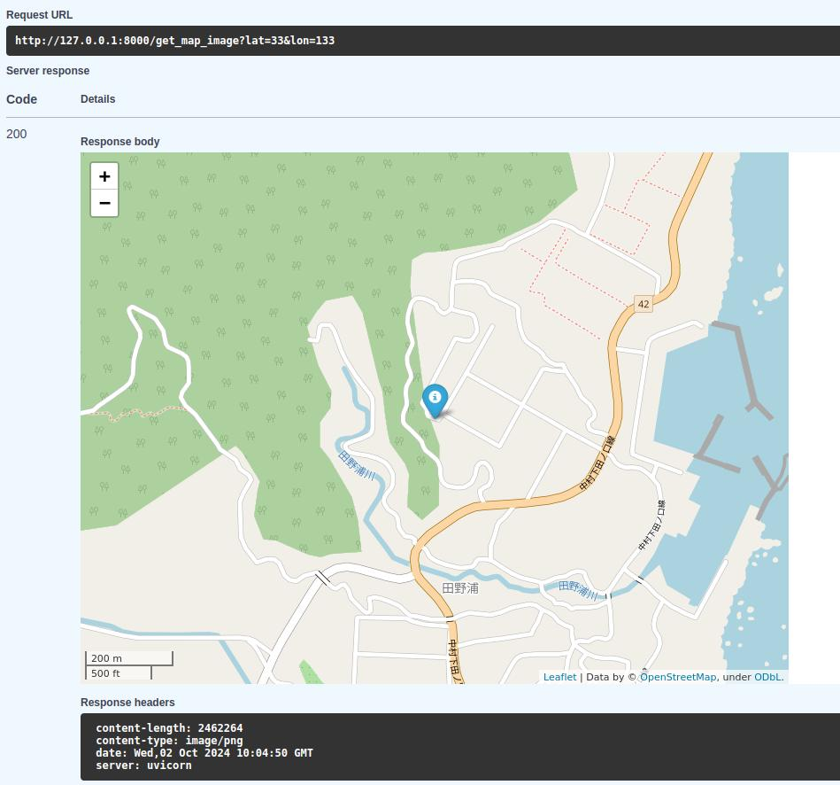

# GeoMapper


GeoMapper is a small Python-based tool for creating interactive geospatial maps using Folium, served through a FastAPI web interface. The project is Dockerized for easy deployment and scalability. 
Initially created during my experiments with Folium, GeoMapper has since been enhanced to offer a more robust and user-friendly experience for generating geospatial maps.

Example screenshot:

## Features

- Create interactive maps centered on any point on Earth.
- Add custom markers with popups and icons.
- Serve maps through FastAPI with input coordinates.
- Download generated maps as HTML files.
- Dockerized for easy setup and scaling.

## Installation

### Running with Docker

1. **Clone the repository**:
    ```bash
    git clone https://github.com/Serg-Mir/GeoMapper.git
    cd GeoMapper
    ```

2. **Build and run with Docker**:
    ```bash
    docker build -t geomapper .
    docker run -d -p 8000:8000 geomapper
    ```

3. **Access the app** at:
   - Generate Map: [http://localhost:8000/generate_map_code?lat=47.9105&lon=33.3918](http://localhost:8000/generate_map_code?lat=47.9105&lon=33.3918)
   - Download Map: [http://localhost:8000/download_map?lat=47.9105&lon=33.3918](http://localhost:8000/download_map?lat=47.9105&lon=33.3918)
   - Get map image: [http://localhost:8000/get_map_image?lat=47.9105&lon=33.3918](http://localhost:8000/get_map_image?lat=47.9105&lon=33.3918)

### Running Locally

1. **Install dependencies**:
    ```bash
    pip install -r requirements.txt
    ```

2. **Run the FastAPI server**:
    ```bash
    uvicorn src.main:app --reload
    ```

3. **Access the app** locally at:
   - Generate Map: `http://127.0.0.1:8000/generate_map_code?lat=47.9105&lon=33.3918`
   - Download Map: `http://127.0.0.1:8000/download_map?lat=47.9105&lon=33.3918`
   - Get map image:`http://127.0.0.1:8000/get_map_image?lat=47.9105&lon=33.3918]`


## Running Tests

1. **Run tests** with `pytest`:
    ```bash
    pytest tests/
    ```

## Contributing

Contributions are welcome! Please fork the repository and open a pull request.

Before starting to contribute to earthquake-app, please install `pre-commit` to ensure your changes are checked for style and standards before committing them to the repository:

    $ pre-commit install

[pre-commit](https://pre-commit.com) is installed automatically in development environment by pip.
If you are running the Docker setup, please install it with `pip` in your host machine:

    $ pip install pre-commit
